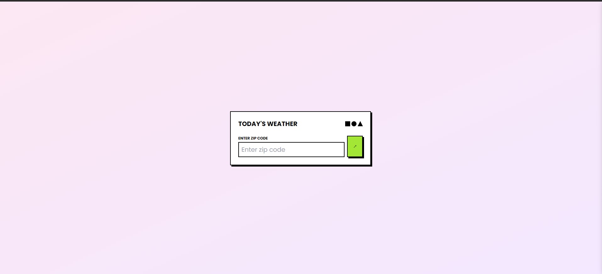
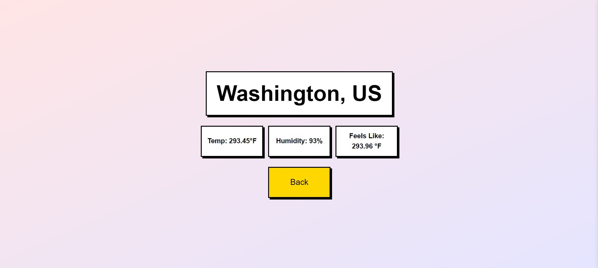
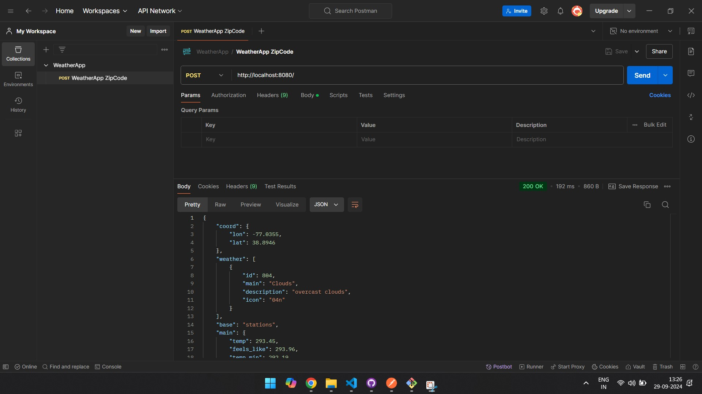

# React WeatherApp Deployment

This project is a full-stack weather application built with React (Frontend) and Node.js (Backend). The frontend fetches weather data using a third-party API and displays it to users based on their location input. The backend serves the API and manages the server-side logic. Docker and Terraform are used to containerize and provision the application on AWS EC2.

## Features

- Fetches real-time weather data for US locations using [WeatherAPI](https://openweathermap.org/api)
- Frontend built with React (running on port 3000)
- Backend built with Node.js (running on port 8080)
- Dockerized frontend and backend apps
- Docker Compose for running both frontend and backend in a single container setup
- Terraform for provisioning an EC2 instance on AWS

---

## Table of Contents

1. [Frontend Setup](#frontend-setup)
2. [Backend Setup](#backend-setup)
3. [Docker Setup](#docker-setup)
4. [Docker Compose Setup](#docker-compose-setup)
5. [Terraform Setup](#terraform-setup)
6. [Application Testing](#application-testing)
7. [Application Screenshot](#application-screenshot)

---

## Frontend Setup

To start the frontend React app locally:

1. **Navigate to the `weather` directory**:
    ```bash
    cd weather
    ```

2. **Install dependencies**:
    ```bash
    npm install
    ```

3. **Start the React app**:
    ```bash
    npm run start
    ```

   - The app will run locally on port `3000`.

---

## Backend Setup

To start the backend Node.js server locally:

1. **Navigate to the `server` directory**:
    ```bash
    cd server
    ```

2. **Install dependencies**:
    ```bash
    npm install
    ```

3. **Start the Node.js server**:
    ```bash
    npm run start
    ```

   - The backend will run locally on port `8080`.

---

## Docker Setup

### Frontend

1. **Navigate to the `weather` directory**:
    ```bash
    cd weather
    ```

2. **Build the Docker image**:
    ```bash
    docker build -t weather-frontend .
    ```

3. **Run the container**:
    ```bash
    docker run -d -p 3000:3000 weather-frontend
    ```

   - The React app will be available on port `3000`.

### Backend

1. **Navigate to the `server` directory**:
    ```bash
    cd server
    ```

2. **Build the Docker image**:
    ```bash
    docker build -t weather-backend .
    ```

3. **Run the container**:
    ```bash
    docker run -d -p 8080:8080 weather-backend
    ```

   - The backend server will be available on port `8080`.

---

## Docker Compose Setup

You can run both the frontend and backend services together using Docker Compose.

1. **Ensure you're in the root directory of the project** where `docker-compose.yml` is located.

2. **Run Docker Compose**:
    ```bash
    docker-compose up --build
    ```

   - This will create and run containers for both the frontend and backend.
   - The frontend will be available on port `3000`, and the backend on port `8080`.

---

## Terraform Setup

You can provision an EC2 instance on AWS to deploy this application using Terraform.

1. **Navigate to the `terraform` directory** where the Terraform configuration files are located.

2. **Initialize Terraform**:
    ```bash
    terraform init
    ```

3. **Plan the infrastructure**:
    ```bash
    terraform plan
    ```

4. **Apply the configuration**:
    ```bash
    terraform apply
    ```

   - This will provision an EC2 instance based on the configurations defined in the `main.tf` file.

5. **Ensure you have set up the following variables in the `terraform.tfvars` file**:
    ```hcl
    access_key    = "your-access-key"
    secret_key    = "your-secret-key"
    key_name      = "your-key-pair-name"
    ami           = "your-ami-id"
    instance_type = "t2.micro"
    volume_size   = 30
    ```

---

## Application Testing

After the application is deployed, you can test it by entering a US zip code to fetch weather data.

1. **Visit the frontend URL**: Navigate to the React app (running on port `3000`).

2. **Enter a US location zip code**:
    - Example zip code: `20500` (Washington, D.C.)

3. **Submit the form** to see the weather data for the entered location.

---

## Application Screenshot





---

## Conclusion

This guide provides steps to deploy the full-stack weather application both locally and on AWS using Docker, Docker Compose, and Terraform. Feel free to test the app by entering any US zip code and fetching real-time weather data!

---

### Contact

For any queries, feel free to reach out to [Aswin Sagar](https://github.com/aswinsagar12) on GitHub.
